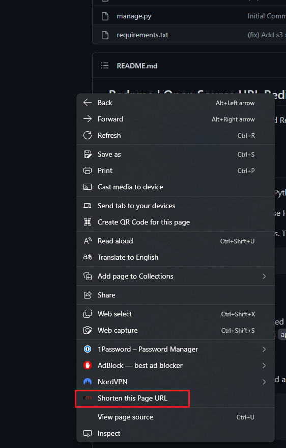
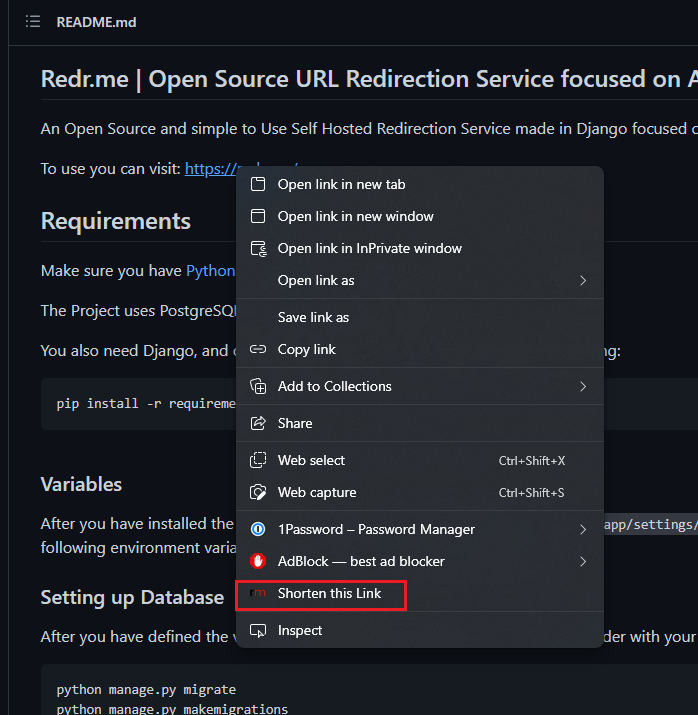
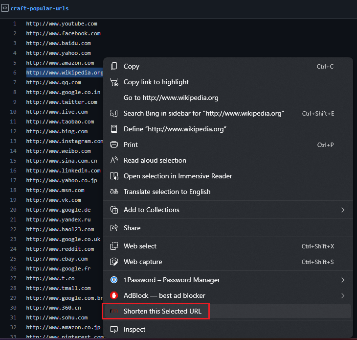
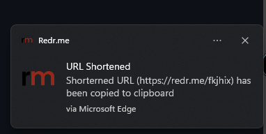

# Redr.me | Open Source URL Redirection Service focused on Anonymity
Chrome Extension for An Open Source and simple to Use Self Hosted Redirection Service made in Django focused on Anonymity.

To use you can visit: https://redr.me/

## Features

### Right Click to Shorten Current Page URL

### Right Click to Shorten Selected Link

### Right Click to Shorten the Selection

### Auto Copy Shortened URL to Clipboard

### 100% Anonymous!

### Contributors

Made with [contrib.rocks](https://contrib.rocks).
